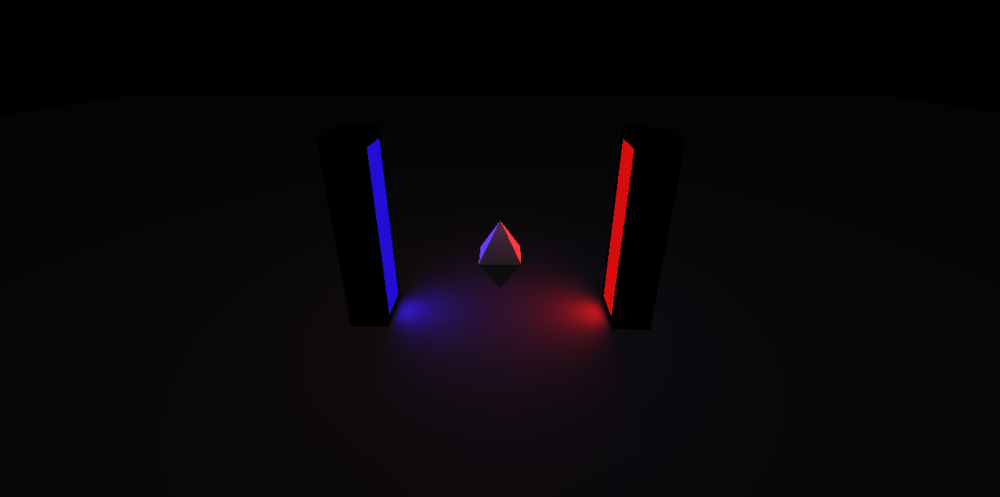

# Rotating diamond
This is my very first experience with Three.js.

My goal was to mess around with the library to understand it better, and there was no initial intention to build a rotating diamond.

# Screenshot
*(Since I can't be bothered myself to deploy it somewhere)*

